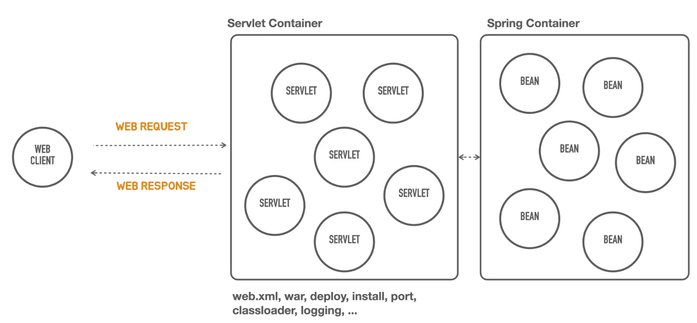

# Helloboot

인프런 토비의 스프링 부트 - 이해와 원리 강의노트

인프런 [토비의 스프링 부트 - 이해와 원리] 강의의 예제 코드입니다.

JDK 11, SpringBoot 2.7.6을 사용합니다.

설치 방법과 코드에 대한 설명은 강의를 참고하세요.

SpringBoot 3.0에서 동작하는 예제는 springboot3 브랜치를 참고해주세요.

# 강의노트

## 스프링 부트 소개

스프링 부트는 스프링을 기반으로 실무 환경에 사용 가능한 수준의 독립실행형 애플리케이션을 복잡한 고민 없이 빠르게 작성할 수 있게 도와주는 여러가지 도구의 모음이다.

[스프링부트 학습페이지 공식](https://spring.io/learn)

[스프링의 시작](https://github.com/spring-projects/spring-framework/issues/14521)

## Containerless

- 컨테이너가 없다? => 서버리스라는 뜻
    - 서버설치 및 관리를 하지 않고 서버 애플리케이션을 개발할 수 있다는 뜻
- 컨테이너는?
    - 스프링의 IoC 컨테이너인가? => 서블릿 컨테이너
    - 서블릿 컨테이너를 배우고 설정하는게 아주 어렵다.
- 서블릿 컨테이너에 대한 학습이나 설정을 하지않고 하고 싶다는 뜻

## Opinionated

- 자기주장을 고집하는
- (스프링부트가) 다 정해줄께 일단 개발만 해

## sdkman

java sdk 를 설치/관리해주는 툴 

[https://sdkman.io/](https://sdkman.io/)

## 프로젝트 생성하기

```bash
# springboot cli 시작
$ spring shell
# springboot 프로젝트 만들기
$ init -b 2.7.6 -d web -g tobyspring -j 11 -n helloboot -x helloboot
$ cd helloboot
$ ./gradlew bootRun
```

## Hello API 테스트

HTTP 요청을 만들고 응답을 확인하는데 사용되는 도구

- 웹 브라우저 개발자 도구
- curl
- HTTPie: 추천
  - [https://httpie.io/](https://httpie.io/)
  - 명령어 예시 http -v ":8080/hello?name=Spring"
- Intellij IDEA Ultimate - http request
- Postman API Platform
- JUnit Test
- API 테스트 도구

## HTTP 요청과 응답

- HTTP
  - Request
    - Request Line: Method, Path, HTTP Version
    - Headers
    - Message Body
  - Response
    - Status Line: HTTP Version, Status Code, Status Text
    - Headers
    - Message Body

요청/응답 예시

```bash
$ http -v ":8080/hello?name=Spring"
GET /hello?name=Spring HTTP/1.1
Accept: */*
Accept-Encoding: gzip, deflate
Connection: keep-alive
Host: localhost:8080
User-Agent: HTTPie/3.2.1


HTTP/1.1 200
Connection: keep-alive
Content-Length: 12
Content-Type: text/plain;charset=UTF-8
Date: Wed, 08 Feb 2023 00:09:42 GMT
Keep-Alive: timeout=60

Hello Spring


$ 
```

## Containerless 는 어떻게 동작하나?

스프링부트의 구조는 아래처럼 서블릿 컨테이너와 스프링 컨테이너가 구동되어 동작하는 방식이다.



단지 main() 메소드를 실행했는데 서블릿 컨테이너와 스프링 컨테이너가 구동했다.

```java
@SpringBootApplication
public class HellobootApplication {

  public static void main(String[] args) {
    SpringApplication.run(HellobootApplication.class, args);
  }

}
```

이제부터 스프링부트의 도움없이 서블릿 컨테이너와 스프링 컨테이너를 구동해보겠다.

서블릿은 자바의 표준기술이고, 톰캣이 가장 유명한 제품

톰캣도 자바로 만들어진 프로그램이니까 Embbeded 톰캣을 사용할 것임

## 서블릿 컨테이너 띄우기

main() 메소드에서 톰캣을 구동하였음

터미널에서 http -v ":8080" 으로 테스트

```bash
$ http -v ":8080"
GET / HTTP/1.1
Accept: */*
Accept-Encoding: gzip, deflate
Connection: keep-alive
Host: localhost:8080
User-Agent: HTTPie/3.2.1


HTTP/1.1 404
Connection: keep-alive
Content-Language: en
Content-Length: 682
Content-Type: text/html;charset=utf-8
Date: Wed, 08 Feb 2023 22:24:06 GMT
Keep-Alive: timeout=60

<!doctype html><html lang="en"><head><title>HTTP Status 404 – Not Found</title><style type="text/css">body {font-family:Tahoma,Arial,sans-serif;} h1, h2, h3, b {color:white;background-color:#525D76;} h1 {font-size:22px;} h2 {font-size:16px;} h3 {font-size:14px;} p {font-size:12px;} a {color:black;} .line {height:1px;background-color:#525D76;border:none;}</style></head><body><h1>HTTP Status 404 – Not Found</h1><hr class="line" /><p><b>Type</b> Status Report</p><p><b>Description</b> The origin server did not find a current representation for the target resource or is not willing to disclose that one exists.</p><hr class="line" /><h3>Apache Tomcat/9.0.69</h3></body></html>


```

## Front Controller

공통적으로 처리해야하는 부분이 각 서블릿에 중복되어 나타나는 문제가 생겼었음

그래서 Front Controller 를 만들어서 공통적인 처리를 맡기고, 다른 영역은 Handler 에서 구현하도록 하였음

## 스프링 컨테이너 사용

Hello Controller 를 스프링 컨테이너에 넣고 Front Controller 가 필요할 때 부를 수 있도록 하자

스프링 컨테이너는 설정정보와 POJO 를 조합해서 사용할 수 있는 Bean 이라는 것을 만든다.

스프링 컨테이너를 통해 HelloController 를 만들면 재사용할 수 있는 장점이 있음: 싱글턴 패턴

스프링은 싱글턴 레지스트리

## DispatcherServlet 으로 전환

우리가 만든 서블릿이 하는 행동은 2개
 
요청을 메소드에 매핑해주는 작업

파라미터를 전달해주는 작업

우리가 만든 서블릿 대신 DispatcherServlet 을 생성하여 구현

## 애노테이션 매핑 정보 사용

클래스 레벨의 @RequestMapping 과 메소드레벨의 @GetMapping, @PostMapping 매핑을 조합해서 최종적으로 리퀘스트처리를 한다.

String 을 리턴하면 스프링이 자동으로 화면 이름으로 인식 함, 이를 방지하기 위해 메소드에 @ResponseBody 를 사용해야 함 

클래스에 @RestController 를 선언하면 메소드에서는 @ResponseBody 를 생략해도 됨

스프링부트에서는 이런식으로 어디에 어떤 애노테이션을 선언하면 어떤 것이 생략가능하다는 식의 '관례'가 많이 있음 

## RestController 와 Controller 애노테이션의 차이

RestController 는 Controller 를 메타 애노테이션으로 가지고 있음

RestController 는 ResponseBody 를 가지고 있음

그래서 RestController 가 붙은 컨트롤러는 결과를 바디에 넣어서 리턴함

## TomcatServletWebServerFactory 과 DispatcherServlet

TomcatServletWebServerFactory 과 DispatcherServlet 를 스프링의 빈으로 등록하고 스프링 컨테이너가 관리할 수 있도록 해보자

지금은 TomcatServletWebServerFactory 과 DispatcherServlet 이 new 로 생성되고 있음

두 클래스를 생성하는 팩토리 함수를 만들고 @Bean 을 등록한다

그리고 main() 메소드에서 this.getBean 을 호출하면 빈으로 가져올 수 있다.

## Bean 의 라이프 사이클

DispatcherServlet 의 Source code hierarchy Ctrl + H

DispatcherServlet 은 ApplicationContextAware 인터페이스를 구현하고 있음

ApplicationContextAware 의 setApplicationContext() 메소드가 있음

ApplicationContextAware 인터페이스는 빈을 컨테이너가 등록하고 관리하는 중에 컨테이너가 관리하는 오브젝트를 빈에 주입해주는 라이프사이클 메소드임

ApplicationContextAware 인터페이스를 구현한 클래스가 스프링 컨테이너에 빈으로 등록되면 스프링 컨테이너가 Setter 메소드를 실행해 주입해줌

따라서 DispatcherServlet 은 ApplicationContextAware 인터페이스를 구현하고 있기 때문에 명시적으로 setApplicationContext() 메소드를 실행하지 않아도 applicationContext 를 가지고 있게 됨

## Decorator 패턴

HelloService 인터페이스를 구현한 HelloDecorator 를 만들어 보자

HelloDecorator 는 SimpleHelloService 를 의존하도록 만들려고 함

HelloDecorator 는 SimpleHelloService 의 기능에 어떤 기능을 덧붙이고 싶을 때 활용

HelloController 는 HelloService 인터페이스를 구현한 HelloDecorator 에 의존

HelloDecorator 도 HelloService 인터페이스를 구현한 SimpleHelloService 에 의존

HelloService 인터페이스를 구현한 빈은 HelloDecorator, SimpleHelloService 2개

XML 구성정보로 해당 빈이 받아야할 빈을 명시해주거나, 팩토리 메소드로 해당 빈을 생성 해주는 방식으로 해결할 수 있음

@Primary 로 우선순위 빈을 지정해줄 수 있음

## 메타 애노테이션과 합성 애노테이션

애노테이션의 애노테이션이 메타 애노테이션

애노테이션타입에 사용될 수 있는 애노테이션만 메타 애노테이션이 될 수 있음

@Controller, @Service 가 예시

합성 애노테이션 composed annotation 은 여러 개의 메타 애노테이션을 가지고 있는 애노테이션 

@RestController 가 예시


